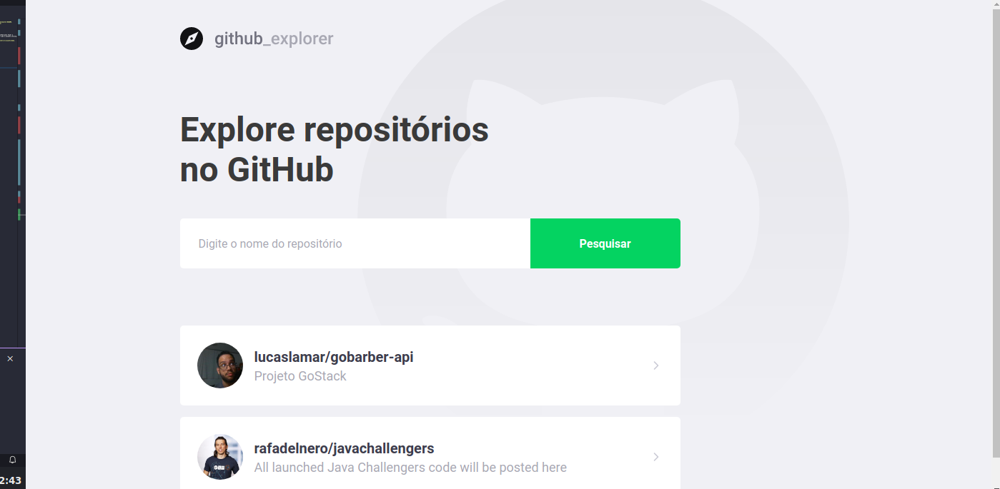

<h1 align="center">GitHub Repositories</h1>

  <a href="https://github.com/Rocketseat/bootcamp-gostack-desafio-05/blob/master/README.md"></a>


</h3>
<p align="center">
  <b>Github Repositories</b> é uma simples single page que usa api to Github para fazer a listagem de Repostitorios e mostrar os detalhes do mesmo, vale lembrar que o projeto utiliza,styled-components💅</p>




## Getting Started
Clone o Repositorio e execute os seguintes comandos:
```sh
yarn -> install dependecies
start -> react-scripts start,
build -> react-scripts build,
test -> react-scripts test,
eject -> react-scripts eject

```


### Contributing
  Se gostou deixe uma estrela